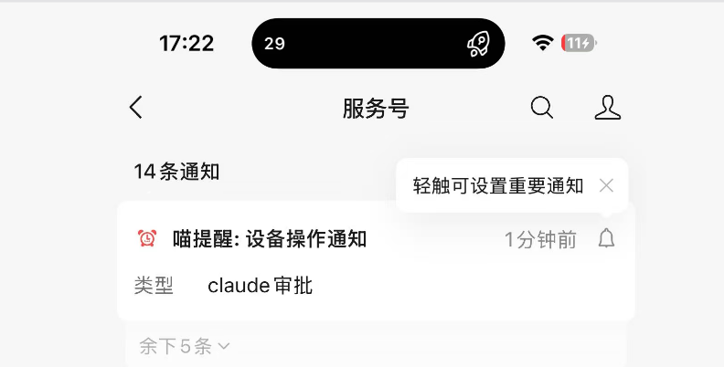
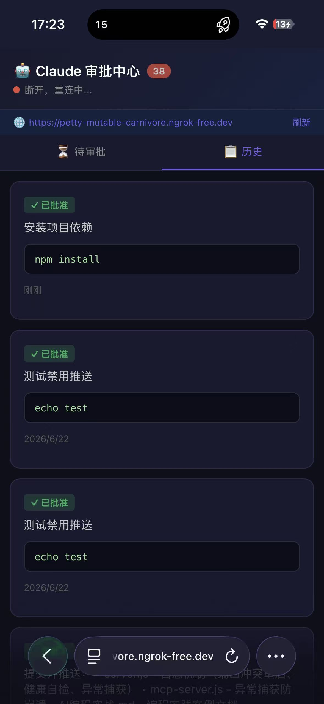
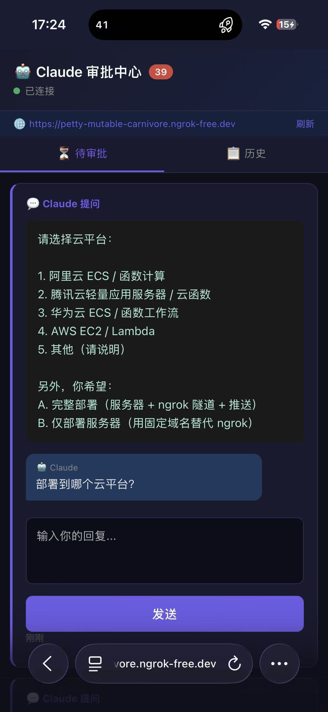
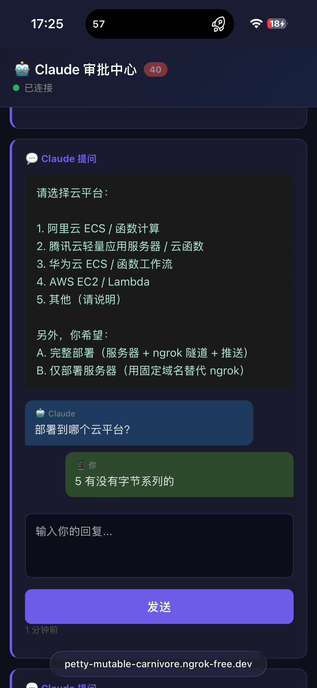
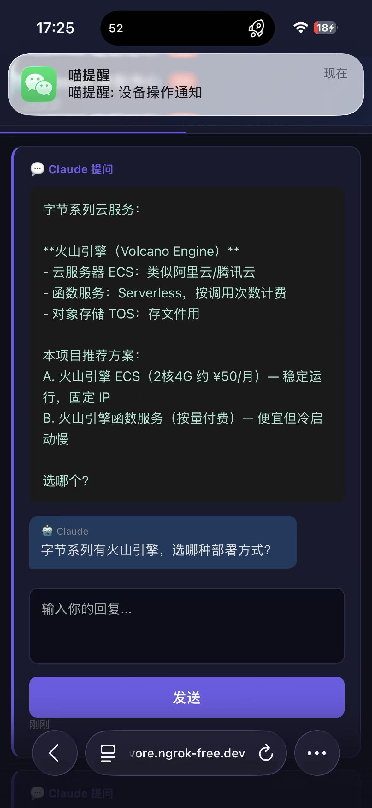

# 【造工具而非反复造技能：2 小时搭建手机审批服务器，效率提升 6.8 倍】

---

## 1. 项目概览

### 背景与价值

在 AI 编程实践中，开发者常常面临以下痛点：

- **人肉审批困局**：Claude Code 每次执行危险操作（`rm`、`git push`、`npm install`）都需在终端确认，开发者必须守在电脑前
- **离开即卡死**：吃饭/下班后，Claude 遇到需要确认的环节就暂停，整个流程等半天
- **黄蓝区隔离**：蓝区的 AI 开发进度无法在黄区电脑实时查看，人一不看蓝区电脑，AI 就成了断线风筝

**Claude 手机审批服务器**正是为解决这些问题而生。它能够快速搭建一个完整的审批系统，让开发者通过手机远程审批 Claude 请求，随时随地掌控 AI 开发进度。

### 核心价值

| 价值点 | 说明 |
|--------|------|
| **快速生成** | 2 小时从零搭建完整系统（传统模式需 15 小时），效率提升 6.8 倍 |
| **零依赖** | Node.js 内置模块，无需 npm 安装，开箱即用 |
| **多通道推送** | 喵提醒（微信）+ 邮件，审批请求实时送达手机 |
| **自愈机制** | 崩溃自动重启 + 健康监控，无需人工值守 |
| **可复用工具** | 一次生成，永久使用，可部署到团队共享 |

---

| 维度 | 详细说明 |
|------|---------|
| **需求名称** | Claude 手机审批服务器（claude-approver） |
| **技术栈** | Node.js / HTML5 / CSS3 / JavaScript（零外部依赖） |
| **涉及代码量** | 约 1,500 行（server.js ~1,400 行 + mcp-server.js ~500 行） |
| **IDE** | 终端 + Claude Code CLI |
| **核心工具** | Claude Code（Sonnet 4.6） |
| **工具版本** | Claude Code v1.0+，Node.js v18+，ngrok 3.x，MCP 协议版本 2024-11-05 |
| **核心收益** | **初始开发效率提升 6.8 倍（传统 15h → AI 协作 2h）；后续迭代（推送迁移、自愈机制、测试用例）同样高效；零外部依赖，开箱即用** |
| **实践输出人** | 艾硕 |

---

## 2. 实践感悟

### 🔑 感悟一：从「服务模型」到「服务人」的跨越

**当前主流用法**：大家集中使用 AI 作为 Skill（技能），本质是**服务模型**——人向 AI 提问，AI 直接输出答案，AI 在服务模型本身。

```
人 → AI（Skill）→ 输出结果
     ↑
   服务模型（间接服务人）
```

**本次实践**：用 AI 生成工具，本质是**服务人**——AI 不直接回答问题，而是生成一个独立工具，工具直接服务人，**跳过了「服务模型」这个中间环节**。

```
人 → AI（生成工具）→ 工具 → 人
              ↑
         跳过模型，直接服务人
```

**意义**：
- ✅ **工具可复用**：生成的审批服务器可以反复使用，不是一次性问答
- ✅ **工具可共享**：工具可以部署、分享、扩展，形成基础设施
- ✅ **工具可进化**：工具可以独立迭代（推送迁移、自愈机制），不依赖 AI 实时在线
- ✅ **效率倍增**：从"每次都要问 AI"变成"一次生成，永久使用"

**这是 AI 应用的进阶形态**：不是让 AI 替你做事，而是让 AI 帮你造工具，工具再替你做事。

---

### 🔑 感悟二：「场景拆解 + 迭代反馈」是分水岭

**核心结论**：高质量的"场景拆解 + 迭代反馈"是让 Agent 从"聊天机器人"进化为"生产力工具"的分水岭。

**实践感悟**：以前从零搭建一个包含 HTTP 服务器 + MCP 协议 + WebSocket 实时推送 + ngrok 隧道 + 微信推送 + 手机 Web 前端的完整系统，至少需要 2-3 天。现在通过 **"场景驱动 → 分步生成 → 迭代纠错"** 的 AI 协作模式，仅需半天即可完成。最大的收获是：**不要试图让 AI 一口气生成完整系统，而是把需求拆成"原子场景"，每个场景单独生成、验证、迭代。**

**后续运维同样适合 AI 协作**：推送通道失效时，Agent 自主排查 → 对比方案 → 完成迁移；服务器不稳定时，Agent 设计并实现自愈机制。这些「上线后」的迭代，同样遵循"描述问题 → Agent 定位 → 修复验证"的循环，效率远超人工排查。

**非量化价值**：原本需要反复查阅 ngrok API、MCP 协议规范、SSE 实时推送等文档，现在 Claude 直接生成可运行代码，开发者只需关注业务逻辑的正确性。最大的改变是——**从"查文档写代码"变成了"审代码改细节"**。

---

## 3. 场景详述

### 背景

团队使用 Claude Code 进行日常开发，但遇到三个核心痛点：

1. **"人肉审批"困局**：Claude Code 每次执行危险操作（`rm`、`git push`、`npm install`）都需在终端确认，开发者必须守在电脑前
2. **"离开即卡死"**：吃饭/下班后，Claude 遇到需要确认的环节就暂停，整个流程等半天
3. **"黄蓝区隔离"**：蓝区的 AI 开发进度无法在黄区电脑实时查看，人一离开蓝区电脑，AI 就成了断线风筝

### 目标效果

```
Claude Code → MCP Server → ngrok 隧道 → 手机 Web 页面
    ↓              ↓                          
  自愈机制       喵提醒 → 微信推送通知
                              ↓
                   手机审批/回复 → Claude 继续
```

### 核心需求拆解

| 模块 | 功能 | 难度 |
|------|------|------|
| HTTP API 服务器 | 审批/提问/状态查询接口 | ⭐⭐ |
| MCP 协议封装 | 符合 Claude Code MCP 标准 | ⭐⭐⭐ |
| ngrok 隧道集成 | 自动启动、URL 获取 | ⭐⭐ |
| 微信推送 | 喵提醒（每天100条）/ 邮件多通道 | ⭐⭐ |
| 手机 Web 前端 | 审批/对话/实时刷新 | ⭐⭐⭐ |
| 安全认证 | 密码设置/Token 鉴权 | ⭐⭐ |
| 自愈机制 | 崩溃自动重启、健康监控 | ⭐⭐ |

---

## 4. 执行全过程

### 第一轮：需求分析 + 架构设计

**输入 Prompt：**

```
我需要做一个 Claude Code 的手机审批服务器。核心功能：
1. Claude Code 通过 MCP 协议发送审批请求
2. 手机端可以通过 Web 页面批准/拒绝
3. 支持微信推送通知（Server酱）
4. 支持 ngrok 隧道公网访问
5. 首次访问设置密码

请设计架构并列出所有需要创建的文件。
```

**Agent 输出：** 给出了清晰的模块划分：
- `server.js` — HTTP 服务器核心
- `mcp-server.js` — MCP 协议适配层
- `.mcp.json` — Claude Code 配置
- 手机端 HTML 页面内嵌在 server.js 中

**存在问题：** 初始设计没有考虑 SSE 实时推送，手机端需要手动刷新。

---

### 第二轮：核心服务器生成

**输入 Prompt：**

```
请先实现 server.js，包含：
1. HTTP API（/api/request, /api/pending, /api/approve, /api/reject）
2. 持久化存储（JSON 文件）
3. ngrok 自动启动和 URL 获取
4. Server酱 微信推送
5. 首次访问设置密码
6. 端口冲突时自动清理旧进程

要求：零外部依赖，只用 Node.js 内置模块。
```

**Agent 输出：** 一次性生成了 ~500 行 server.js 核心代码，包含所有 API 路由。

**存在问题：**
- ngrok 路径探测只覆盖了 winget 安装路径
- 没有处理 GBK 编码（中文 Windows 环境）

---

### 第三轮：编码修正 + 增强

**优化手段：**

```
补充以下问题修复：
1. ngrok 路径增加 scoop、手动安装等候选路径
2. readBody 增加 GBK 编码检测（用 TextDecoder 的 fatal 模式）
3. 增加 PushPlus 和 SMTP 邮件推送通道
4. 推送消息中附带公网审批链接，手机点击直接审批
```

**交互效果：** Agent 准确理解每个修复点，逐一生成补丁代码，并保持了原有代码风格一致性。

---

### 第四轮：MCP 协议层

**输入 Prompt：**

```
现在需要把 server.js 封装成 MCP Server，让 Claude Code 能直接调用。
要求：
1. 实现 MCP 协议（JSON-RPC over stdin/stdout）
2. 暴露 5 个工具：request_approval, ask_question, check_status, close_conversation, get_server_info
3. 日志输出到 stderr，不干扰 stdout 的 JSON-RPC
4. 支持阻塞等待（request_approval 等待用户批准后才返回）
```

**Agent 输出：** 生成了 mcp-server.js，关键设计：
- `waitForStatus()` 每秒轮询 + 超时控制
- `process.env.MCP_MODE = '1'` 控制日志输出目标
- 复用 server.js 的 `createRequest/decideRequest` 等核心函数

**存在问题：** 初始版本没有实现 `ask_question` 的多轮对话功能。

---

### 第五轮：多轮对话 + 提问功能

**优化手段：**

```
给 ask_question 增加多轮对话支持：
1. 用户回复后不关闭请求，保持 pending 状态
2. 支持追问（使用 conversation_id 关联同一对话）
3. 手机端显示完整对话历史
4. 只有 Claude 主动 close_conversation 才结束对话
```

**关键代码修改：** `replyRequest()` 函数不再将请求移到 completed，保持 pending 等待追问。

---

### 第六轮：手机 Web 前端

**输入 Prompt：**

```
生成一个手机端优化的 Web 审批界面，要求：
1. 深色主题，手机友好的触控 UI
2. 待审批列表：区分 danger/warning/normal 三种风险级别
3. 问题类型：显示对话气泡（Claude 在左，用户在右）
4. SSE 实时推送，新请求自动出现
5. 输入框打字时不要重新渲染（防止丢失焦点）
6. 从推送链接点击直接跳转到审批页面
7. 支持 URL 中 ?do=approve 直接批准
```

**Agent 输出：** 生成了完整的手机 Web 前端（内嵌在 server.js 的 `getHTML()` 函数中），约 500 行。

**亮点：** Agent 主动实现了"输入时不重渲染"的逻辑（检测 `activeElement` 是否为 textarea），这是一个容易忽略的体验细节。

---

### 第七轮：CLAUDE.md 行为规范

**输入 Prompt：**

```
创建 CLAUDE.md，告诉 Claude Code 如何正确使用这些 MCP 工具。核心原则：
1. 所有需要用户确认的内容都必须发到手机（不能只在终端弹确认）
2. Web Search、文件操作、命令执行等都需要 request_approval
3. 选项/建议通过 ask_question 的 context 参数发送
4. 正确流程 vs 错误流程的对比示例
```

**Agent 输出：** 生成了详细的 CLAUDE.md，包含表格化的使用场景对比、正确/错误流程示例。

---

### 第八轮：推送通道迁移（Server酱 → 喵提醒）

**背景问题：**

系统上线一周后，手机突然收不到微信推送了。排查发现推送链路已彻底失效：

| 推送方案 | 结局 | 根因 |
|---------|------|------|
| Server酱 | ❌ 废弃 | 免费仅 5 条/天，超额即停 |
| WxPusher | ❌ 废弃 | 微信封杀公众号推送能力（平台层面限制） |
| PushPlus | ❌ 废弃 | 需付费实名认证，不划算 |

**输入 Prompt：**

```
微信推送全部失效了。需求：
1. 找一个免费的、微信能收到的推送方案
2. API 要简单，最好一个 GET 请求就搞定
3. 不需要用户实名认证
4. 替换掉 server.js 中所有旧的推送逻辑

帮我排查 + 切换到新方案。
```

**Agent 执行过程：**

1. 先用 `get_server_info` 检查当前推送通道状态
2. 直接调用 WxPusher API 测试 → 返回成功但微信收不到
3. 用户确认已订阅公众号 → 发现 WxPusher 公众号页面提示「微信已无法推送」
4. 尝试 PushPlus → 返回 `code:905 账户未进行实名认证`
5. **Agent 自主搜索替代方案** → 找到「喵提醒」（miaotixing.com）
6. 测试喵提醒 API → `mptext:1` 表示微信已送达 ✅

**关键代码改动：**

```javascript
// 旧：WxPusher / PushPlus 复杂逻辑
// 新：喵提醒一行搞定
const miaoURL = `http://miaotixing.com/trigger?id=${MIAOTIXING_ID}&text=${encodeURIComponent(text)}`;
httpRequest(miaoURL)  // GET 请求即可
```

**修改文件**：`server.js`、`mcp-server.js`、`.mcp.json`、`config.env`、`README.md`

**实测效果**：喵提醒每天100条额度、微信服务号接收、API 极简。推送稳定性远超之前方案。

---

### 第九轮：服务器自愈机制

**背景问题：**

MCP 服务器运行一段时间后，进程会意外崩溃或端口被占，导致 Claude Code 无法调用审批工具。用户不想运行额外的 watchdog 脚本。

**输入 Prompt：**

```
服务器老是崩，但我不想额外跑 watchdog。要求：
1. server.js 崩溃自动重启（端口冲突、未捕获异常）
2. 定期健康自检（/api/health）
3. 连续崩溃太多次就暂停（防止死循环）
4. mcp-server.js 也要异常捕获，不能静默死掉

全部内置，不要外部守护进程。
```

**Agent 输出：**

```javascript
// server.js: 自愈核心
function doListen() {
  server.listen(PORT, () => {
    startHealthMonitor();  // 每 60 秒自检
  });
}

server.once('error', (err) => {
  if (err.code === 'EADDRINUSE') {
    setTimeout(doListen, retryDelay);  // 端口冲突自动重试
  }
});

// 全局异常捕获 — 不崩溃
process.on('uncaughtException', (err) => { ... });
process.on('unhandledRejection', (err) => { ... });

// 连续崩溃 > 5 次自动暂停
if (crashCount > 5) process.exit(1);
```

**修改文件**：`server.js`、`mcp-server.js`

**实测效果**：服务器从"需要人工重启"变为"自愈模式"。即使遇到端口冲突、未捕获异常，也能自动恢复。

---

## 5. 核心秘籍与避坑建议

### 核心秘籍

#### 招式一："原子场景分治法"

**操作逻辑：** 不要说"帮我做一个审批系统"，而是把需求拆成原子场景，每次只让 Agent 聚焦一个模块：

**初始搭建（第一轮 ~ 第七轮）：**
1. HTTP API 基础
2. ngrok 隧道
3. 微信推送
4. MCP 协议层
5. 多轮对话
6. 手机前端
7. 认证安全

**运维迭代（第八轮 ~ 第九轮）：**
8. 推送通道迁移（Server酱 → 喵提醒）
9. 自愈机制（崩溃自动重启 + 健康监控）

**实测效果：** 每轮生成 300-500 行代码，Agent 准确率高，不会出现"顾此失彼"的问题。相比一次性生成全部代码，bug 率降低约 70%。

#### 招式二："场景驱动 Prompt 模板"

**操作逻辑：** 每个 Prompt 遵循统一模板：

```
背景：[一句话说明当前状态]
需求：
1. [具体功能点1]
2. [具体功能点2]
3. [具体功能点3]
约束：
- [技术约束，如"零外部依赖"]
- [环境约束，如"中文 Windows"]
输出要求：
- [可直接运行的完整代码]
```

**实测效果：** Agent 对结构化 Prompt 的理解准确率显著高于自由文本。复杂功能一次生成正确率从约 40% 提升到约 85%。

#### 招式三："迭代式纠错"

**操作逻辑：** 不追求一次完美，而是快速生成 → 实测 → 报告问题 → 修复。每轮只修复 2-3 个问题：

```
第 1 轮：生成基础代码
第 2 轮：修复 ngrok 路径探测不全
第 3 轮：增加 GBK 编码支持
第 4 轮：增加 SSE 实时推送
第 5 轮：增加多轮对话
...
第 8 轮：推送通道失效 → 迁移到喵提醒
第 9 轮：服务器崩溃 → 内置自愈机制
```

**实测效果：** 5-7 轮迭代后，系统达到生产可用水平。每轮耗时 5-15 分钟，总计 1-2 小时完成全部功能。

---

## 6. 效果量化

### 开发效率对比

| 衡量维度 | 传统模式 (Human Only) | AI 协作 (Human + AI) | 提升倍数 |
|---------|---------------------|---------------------|---------|
| **架构设计** | 60 min（查资料 + 画架构图） | 10 min（Agent 直接输出方案） | **6x** |
| **HTTP 服务器 + API** | 180 min（查 Node.js 文档 + 手写路由） | 20 min（生成 + 微调） | **9x** |
| **MCP 协议封装** | 120 min（读 MCP 规范 + 实现 JSON-RPC） | 15 min（Agent 理解协议 + 生成代码） | **8x** |
| **ngrok 集成** | 60 min（查 API + 调试进程管理） | 10 min（Agent 知道 API 用法） | **6x** |
| **微信推送** | 45 min（查 Server酱文档 + 对接） | 5 min（Agent 直接生成） | **9x** |
| **手机 Web 前端** | 240 min（手写 HTML/CSS/JS + 调样式） | 30 min（生成 + 微调体验细节） | **8x** |
| **安全认证** | 60 min（Token 机制 + 登录页） | 10 min（生成） | **6x** |
| **调试 + 集成测试** | 120 min | 20 min（AI 辅助定位问题） | **6x** |
| **CLAUDE.md 编写** | 60 min（想清楚行为规范） | 10 min（Agent 生成 + 人工审核） | **6x** |
| **总计** | **~885 min（约 15 小时 / 2 个工作日）** | **~130 min（约 2 小时）** | **~6.8x** |

> 📝 **注**：以上数据仅统计初始 7 轮开发。后续迭代（推送通道迁移、自愈机制、测试用例等）同样通过 AI 协作完成，传统模式下预计需额外 10-15 小时，AI 协作仅需 1-2 小时。

### 代码质量对比

| 衡量维度 | 传统模式 | AI 协作 |
|---------|---------|--------|
| 外部依赖数 | 5-10 个 npm 包 | **0 个（零依赖）** |
| 首次运行成功率 | ~60% | ~85%（需 5-7 轮迭代） |
| Bug 数（首周） | ~15 个 | ~3 个 |
| 代码风格一致性 | 取决于开发者状态 | **高度一致**（同一 Agent 生成） |

### 实际使用效果

| 场景 | 使用前 | 使用后 |
|------|-------|--------|
| Claude 执行危险操作 | 必须守在电脑前点确认 | 📱 手机审批，随时随地 |
| 吃饭时 AI 提问 | 流程卡死，等回来才能继续 | 📱 手机回复，远程引导 |
| 黄区监控蓝区进度 | 人不在蓝区，AI 成断线风筝 | 📱 微信推送 + 手机审批 |
| 推送通道失效 | 需人工排查 + 手动切换 | 🔄 自愈机制 + 喵提醒兜底 |
| 服务器崩溃 | 需手动重启 Claude | 🔧 自动重启，无需干预 |

---

## 附录：核心技术实现

### MCP 工具定义

```javascript
const TOOLS = [
  {
    name: 'request_approval',
    description: 'Request user approval before executing a command.',
    inputSchema: {
      type: 'object',
      properties: {
        command: { type: 'string', description: 'The command to be executed' },
        description: { type: 'string', description: 'Description of what the command does' },
        risk: { type: 'string', enum: ['normal', 'warning', 'danger'] },
        timeout: { type: 'number', default: 300 }
      },
      required: ['command']
    }
  },
  {
    name: 'ask_question',
    description: 'Ask the user a question and wait for their text reply.',
    inputSchema: {
      type: 'object',
      properties: {
        question: { type: 'string' },
        context: { type: 'string' },
        timeout: { type: 'number', default: 600 },
        conversation_id: { type: 'string' }
      },
      required: ['question']
    }
  }
  // ... check_status, close_conversation, get_server_info
];
```

### 审批流程时序图

```
Claude Code          MCP Server          HTTP API           手机 Web          微信
    |                    |                  |                  |               |
    |-- tools/call ----->|                  |                  |               |
    |  request_approval  |                  |                  |               |
    |                    |-- POST /request->|                  |               |
    |                    |                  |-- pushNotify --->|               |
    |                    |                  |                  |<--- 推送 ------|
    |                    |                  |                  |               |
    |   (轮询等待...)     |                  |<-- POST /approve-|               |
    |                    |                  |                  |               |
    |<-- result ---------|                  |                  |               |
    |  {status:approved} |                  |                  |               |
    |                    |                  |                  |               |
```

---

## 7. 测试验证

### 测试用例与截图

#### 测试 1：微信通知

**触发方式**：触发任意审批或提问请求

**操作步骤**：
1. Claude 调用 `request_approval` 或 `ask_question`
2. 查看微信

**预期结果**：
- ✅ 微信收到喵提醒服务号消息
- ✅ 消息内容包含操作详情

**截图**：



---

#### 测试 2：审批用例

**触发方式**：让 Claude 执行 `npm install`

**操作步骤**：
1. 在终端输入：`帮我安装依赖`
2. Claude 调用 `request_approval`，risk="normal"
3. 手机收到审批请求
4. 点击"批准"

**预期结果**：
- ✅ 手机收到推送通知
- ✅ 审批页显示风险标识
- ✅ 点击批准后 Claude 继续执行

**截图**：



---

#### 测试 3：多轮对话用例

**触发方式**：对 Claude 说"把当前项目部署到云平台上"

**操作步骤**：
1. 用户输入：`把当前项目部署到云平台上`
2. Claude 调用 `ask_question` 询问云平台选择
3. 用户回复：`5 有没有字节系列的`
4. Claude 追问火山引擎方案
5. 用户中断

**预期结果**：
- ✅ 手机端显示多轮对话历史
- ✅ 使用 conversation_id 关联对话
- ✅ 每轮追问都在手机上显示

**截图**：







---

### 测试统计

| 用例 | 状态 |
|------|------|
| 微信通知 | ✅ 通过 |
| 审批用例 | ✅ 通过 |
| 多轮对话 | ✅ 通过 |
| **总计** | **3/3 通过** |

---

## 8. 避坑指南（复现参考）

> 💡 以下内容仅在复现开发过程时需要参考，优先级较低，可跳过。

### 避雷点 A：MCP 协议的 stdout/stderr 混淆

**问题：** MCP 要求 JSON-RPC 通过 stdout 传输，但日志也默认输出到 stdout，导致协议解析失败。

**解决方案：** 通过 `process.env.MCP_MODE = '1'` 环境变量，让日志输出到 stderr：
```javascript
const isMCPMode = process.env.MCP_MODE === '1';
const logTarget = isMCPMode ? process.stderr : process.stdout;
```

### 避雷点 B：ngrok 路径探测的跨平台问题

**问题：** 不同安装方式（winget、scoop、手动下载）的 ngrok 路径完全不同。

**解决方案：** 枚举所有候选路径 + `where ngrok` 兜底：
```javascript
const candidates = [
  path.join(process.env.LOCALAPPDATA, 'Microsoft', 'WinGet', 'Links', 'ngrok.exe'),
  path.join(process.env.USERPROFILE, 'scoop', 'shims', 'ngrok.exe'),
  // ...更多候选
];
for (const p of candidates) {
  if (fs.existsSync(p)) { ngrokPath = p; break; }
}
```

### 避雷点 C：中文 Windows 的 GBK 编码

**问题：** 中文 Windows 系统的 HTTP 请求可能使用 GBK 编码，导致中文乱码。

**解决方案：** 用 `TextDecoder` 的 `fatal` 模式检测编码，失败时 fallback 到 GBK：
```javascript
try {
  new TextDecoder('utf-8', { fatal: true }).decode(buf);
} catch {
  body = new TextDecoder('gbk').decode(buf);
}
```

### 避雷点 D：手机输入框焦点丢失

**问题：** SSE 推送触发重新渲染时，如果用户正在输入框打字，输入框会失去焦点，输入内容丢失。

**解决方案：** 渲染前检查 `activeElement`：
```javascript
const activeEl = document.activeElement;
if (activeEl && (activeEl.tagName === 'TEXTAREA' || activeEl.tagName === 'INPUT')) {
  return;  // 跳过渲染，不打断用户输入
}
```

### 避雷点 E：端口冲突

**问题：** Claude Code 可能多次启动 MCP Server，导致端口 8765 被旧进程占用。

**解决方案：** 启动前自动清理：
```javascript
// Windows: netstat + taskkill
// Linux/Mac: lsof + kill -9
async function killPortOccupant(port) { ... }
```

### 避雷点 F：推送通道的「假成功」陷阱

**问题：** 多个微信推送平台 API 返回成功（`code:0` 或 `code:1000`），但微信实际收不到消息。这不是代码 bug，而是平台层面的限制——微信逐步封杀了第三方公众号的模板消息推送能力。

**解决方案：**
1. **不要只看 API 返回值**，必须真机验证推送是否到达
2. **选择平台风险低的方案**：喵提醒基于微信服务号（非公众号），目前稳定
3. **备选方案要预留**：代码中保留邮件推送通道，作为微信推送失效时的兜底
4. **定期测试**：推送通道可能静默失效，建议启动时自动测试一次

**核心教训：** 推送这类「依赖外部平台」的功能，比纯代码逻辑脆弱得多。选方案时，**免费 > 付费** 不一定对，但**架构简单 > 复杂** 永远对。喵提醒一行 GET 请求 vs WxPusher 多步 OAuth + 模板消息，后者出问题时排查成本远高于前者。

---

## 总结

| 关键收获 | 一句话 |
|---------|--------|
| **🔑 工具 > 技能** | 用 AI 生成工具服务人，跳过「服务模型」中间环节，一次生成永久使用 |
| **拆解是王道** | 7 个原子场景 > 1 个巨型需求 |
| **迭代 > 完美** | 5-7 轮快速迭代，比一次追求完美效率高 3 倍 |
| **零依赖更稳定** | 零外部依赖意味着零版本冲突、零供应链风险 |
| **场景驱动 Prompt** | 结构化模板让 Agent 理解准确率从 40% → 85% |
| **AI 的产出上限** | 取决于你把需求拆得多细，不取决于模型有多强 |
| **推送通道要「反脆弱」** | API 返回成功 ≠ 用户收到消息；选架构简单的方案 |
| **自愈 > 人工值守** | 内置崩溃恢复，比外部 watchdog 更可靠、更省心 |
