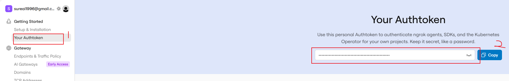

# 📱 Claude 手机审批服务器

> 在手机上审批 Claude Code 的操作，不用守着电脑。

---

## 🎯 使用场景

### 场景 1：黄区监控蓝区 AI 开发

**问题**：蓝区的 AI 开发进度无法在黄区电脑实时查看。人一不看蓝区电脑，AI 就成了断线风筝，无法掌握任务动态。

**解决**：
- Claude 在蓝区执行开发任务
- 每个关键操作通过手机推送通知
- 在黄区用手机审批，远程掌控进度

```
蓝区 Claude: "要执行 git push 吗？"
     ↓ 推送
黄区手机: [批准] [拒绝]
     ↓ 点击
蓝区 Claude: 收到批准，继续执行
```

### 场景 2：离开电脑时 AI 不再卡死

**问题**：吃饭/下班后，Claude 遇到问题需要人工回答，整个流程卡死等你回来。

**解决**：
- Claude 的审批/提问推送到手机
- 吃饭时手机回复，不用跑回电脑前
- 支持多轮对话，远程引导 Claude

```
Claude: "我先请求审批，再搜索 MobaXterm 宏功能"
     ↓ 推送审批请求
手机收到: "Web Search: MobaXterm macro feature"
          [批准] [拒绝]
     
你在吃饭 🍜 点击批准
     ↓
Claude: 收到批准，继续搜索 ✅
```

### 场景 3：危险操作远程审批

**问题**：Claude 要执行 `rm -rf` 等危险操作，但你不在电脑前。

**解决**：
- 危险操作自动暂停，等待审批
- 手机收到红色警告
- 确认安全后才批准执行

---

## 🚀 快速开始

> 💡 **适合人群**：从未接触过本项目的同学  
> ⏱️ **预计耗时**：10-15 分钟  
> 📋 **你需要准备**：一台电脑、一部手机、微信号

---

### 第一步：获取 ngrok Token（5 分钟）

**什么是 ngrok？**  
ngrok 是一个内网穿透工具，让你的手机能从外网访问电脑上的审批服务器。

**获取步骤**：

1. 打开浏览器，访问 https://dashboard.ngrok.com/signup
2. 注册账号（建议用 GitHub 登录，最快）
3. 登录后，复制页面上显示的 **Your Authtoken**（一串很长的字符）
4. 保存好这个 token，后面要用



---

### 第二步：获取喵提醒喵码（3 分钟）

**什么是喵提醒？**  
喵提醒是一个微信推送服务，审批请求会通过微信服务号发到你手机上。

**获取步骤**：

1. 微信扫码关注「喵提醒」服务号（或搜索 miaotixing）
2. 点击菜单栏「我的喵码」→「获取喵码」
3. 复制你的喵码（一串类似 `abc123` 的字符）
4. 保存好这个喵码，后面要用

---

### 第三步：创建配置文件（2 分钟）

**在你准备运行 `claude` 命令的目录下**，创建一个名为 `.mcp.json` 的文件。

> ⚠️ **重要**：这个文件必须放在你运行 `claude` 的目录下！比如你在 `D:\my-project` 下运行 claude，那 `.mcp.json` 就要放在 `D:\my-project\.mcp.json`

**复制以下内容，替换其中的占位符**：

```json
{
  "mcpServers": {
    "approver": {
      "command": "node",
      "args": ["D:/projects/claude-approver/mcp-server.js"],
      "env": {
        "PORT": "8765",
        "TUNNEL": "ngrok",
        "NGROK_AUTHTOKEN": "这里替换为你的ngrok_token",
        "MIAOTIXING_ID": "这里替换为你的喵码"
      }
    }
  }
}
```

**替换示例**：

假设你的：
- ngrok token 是 `2abc123xyz456...`
- 喵码是 `miao789`

替换后应该是：

```json
{
  "mcpServers": {
    "approver": {
      "command": "node",
      "args": ["D:/projects/claude-approver/mcp-server.js"],
      "env": {
        "PORT": "8765",
        "TUNNEL": "ngrok",
        "NGROK_AUTHTOKEN": "2abc123xyz456...",
        "MIAOTIXING_ID": "miao789"
      }
    }
  }
}
```

---

### 第四步：创建 Claude 行为规范（1 分钟）

在**同一个目录**下，创建一个名为 `CLAUDE.md` 的文件。

> 💡 **为什么需要这个文件？**  
> Claude 默认会在终端弹窗让你确认操作。有了这个文件，Claude 就会把确认请求发到你的手机上。

**直接复制以下内容**（不需要修改）：

```markdown
# 手机审批规范

所有需要用户确认的内容都必须发到手机，不能在终端直接弹确认框。

## 操作前必须请求手机审批

所有可能产生影响的操作，都必须先调用 `request_approval` 获得批准：

| 操作类型 | 是否需要审批 |
|---------|-------------|
| Web Search | ✅ 需要 |
| 执行命令（bash、npm、git 等） | ✅ 需要 |
| 读写文件 | ✅ 需要 |
| 网络请求 | ✅ 需要 |
| 安装软件 | ✅ 需要 |

## 提问必须发到手机

所有需要用户回答、选择、确认的内容，都必须通过 MCP 工具发到手机：

- 问题 → 用 `ask_question` 发到手机
- 选项/建议 → 用 `ask_question` 的 `context` 参数发送
- 操作审批 → 用 `request_approval` 发到手机
```

---

### 第五步：启动 Claude（30 秒）

打开终端（命令提示符/PowerShell/Terminal），进入你的项目目录，运行：

```bash
cd D:\my-project
claude
```

**你应该看到类似这样的输出**：

```
╔═══════════════════════════════════════════════════════════════╗
║  Claude 手机审批服务器                                         ║
╠═══════════════════════════════════════════════════════════════╣
║  ✓ 服务器已启动：http://localhost:8765                        ║
║  ✓ ngrok 隧道已建立                                           ║
║  ✓ 公网地址：https://abc123.ngrok-free.dev                    ║
║  ✓ 喵提醒推送已配置                                           ║
╚═══════════════════════════════════════════════════════════════╝
```

> ⚠️ **如果看到错误**：检查 `.mcp.json` 中的路径是否正确，ngrok token 和喵码是否填对。

---

### 第六步：手机访问（1 分钟）

1. 打开手机浏览器
2. 输入启动时显示的**公网地址**（类似 `https://abc123.ngrok-free.dev`）
3. 首次访问会要求设置密码，**设置一个你记得住的密码**（比如 `123456`）
4. 输入密码后进入审批页面

**你应该看到**：
- 一个深色主题的页面
- 顶部显示「待审批请求」
- 下方是操作区域

---

### 第七步：测试一下（2 分钟）

在 Claude 终端中输入：

```
帮我搜索一下今天的天气
```

**预期效果**：

1. Claude 会说：「我需要先请求手机审批」
2. 你的手机会收到微信推送（来自「喵提醒」服务号）
3. 推送内容：「Claude 请求审批：Web Search - 搜索今天的天气」
4. 点击推送链接，进入审批页面
5. 点击「批准」按钮
6. Claude 继续执行搜索，并把结果告诉你

**恭喜！你已经成功配置了手机审批系统！** 🎉

---

### 常见问题排查

**Q1：Claude 启动时报错「Cannot find module」**  
A：检查 `.mcp.json` 中 `args` 的路径是否正确。Windows 用户注意用正斜杠 `/` 而不是反斜杠 `\`。

**Q2：手机打不开公网地址**  
A：ngrok 免费版每次启动地址会变。检查终端输出的最新地址。首次打开可能需要点击「Visit Site」按钮。

**Q3：收不到微信推送**  
A：
- 检查喵提醒喵码是否填对
- 检查微信是否关注了「喵提醒」服务号
- 测试推送：访问 `http://miaotixing.com/trigger?id=你的喵码&text=测试&type=json`，看是否返回成功

**Q4：Claude 没有在终端显示审批请求**  
A：检查 `CLAUDE.md` 是否创建，内容是否正确。这个文件告诉 Claude 要用手机审批。

**Q5：公网地址每次启动都变**  
A：ngrok 免费版的限制。如果需要固定地址，需要付费升级 ngrok，或者考虑使用其他内网穿透方案。

---

## 📲 功能说明

### MCP 工具

| 工具 | 用途 |
|------|------|
| `request_approval` | 请求用户批准操作 |
| `ask_question` | 向用户提问，等待回复 |
| `check_status` | 查询请求状态 |
| `close_conversation` | 结束对话 |
| `get_server_info` | 获取服务器信息 |

### 使用场景

**审批操作**
```
Claude 要执行危险命令 → 手机收到审批请求 → 点"批准"或"拒绝"
```

**提问交互**
```
Claude 需要用户输入 → 手机显示问题 → 用户回复 → Claude 继续
```

**带选项的提问**
```
Claude 调用 ask_question:
  question: "请选择："
  context: "1. 选项A\n2. 选项B\n3. 选项C"

→ 手机显示选项列表 → 用户回复编号
```

---

## 🔧 配置项

| 环境变量 | 说明 | 必填 |
|---------|------|------|
| `PORT` | 本地端口 | 否，默认 8765 |
| `TUNNEL` | 隧道类型 | 否，默认 ngrok |
| `NGROK_AUTHTOKEN` | ngrok 认证 token | 用 ngrok 时必填 |
| `MIAOTIXING_ID` | 喵提醒喵码 | 否，微信推送用（每天100条） |
| `SMTP_HOST` | 邮件 SMTP 主机 | 否，邮件推送用 |
| `SMTP_PORT` | SMTP 端口 | 否，默认 465 |
| `SMTP_USER` | SMTP 用户名 | 否 |
| `SMTP_PASS` | SMTP 密码 | 否 |
| `SMTP_TO` | 收件人邮箱 | 否 |
| `AUTH_TOKEN` | 访问密码 | 否，首次访问时设置 |
| `DISABLE_PUSH` | 禁用推送通知 | 否，默认 false |

### 禁用推送通知

开发调试或夜间模式时，可以禁用微信/邮件推送：

```json
{
  "env": {
    "DISABLE_PUSH": "true"
  }
}
```

禁用后：
- ✅ 审批/提问功能正常（可在手机网页查看）
- ❌ 不发送微信喵提醒/邮件通知
- ✅ 启动时显示 `⚠️ 推送通知已禁用`

支持的值：`true` / `1` / `yes`（不区分大小写）

---

## 📁 文件结构

```
claude-approver/
├── mcp-server.js      # MCP 服务器（协议层，异常捕获）
├── server.js          # HTTP 服务器核心（自愈模式、喵提醒推送）
├── .mcp.json          # MCP 配置（MIAOTIXING_ID=你的喵码）
├── CLAUDE.md          # Claude 使用指南
├── config.env         # 环境变量配置
├── PROJECT_CONTEXT.md # 项目决策与进展记录
├── AI编程实践.md       # 实战复盘文档（含测试用例）
├── TEST_CASES.md      # 测试用例
├── screenshots/       # 测试截图目录
├── start.bat          # 手动启动脚本
└── .data/             # 运行时数据
    ├── auth.json      # 认证信息
    └── requests.json  # 请求记录
```

---

## ❓ 常见问题

**Q: 密码忘了？**
删除 `.data/auth.json`，重启重新设置。

**Q: 手机打不开？**
- 确认服务器在运行
- ngrok 链接首次要点 "Visit Site"

**Q: 公网地址每次变？**
免费版 ngrok 正常现象。

---

## 📝 更新日志

- 2026-06-22: 推送通道迁移：Server酱/WxPusher/PushPlus → 喵提醒（每天100条）
- 2026-06-22: 服务器自愈机制（崩溃自动重启、健康监控）
- 2026-06-22: 新增 `DISABLE_PUSH` 配置，可禁用推送通知
- 2026-06-15: MCP Server 完成，支持审批和对话功能
- 2026-06-15: 修复端口冲突问题，自动清理旧进程
- 2026-06-15: 手机端显示选项列表
